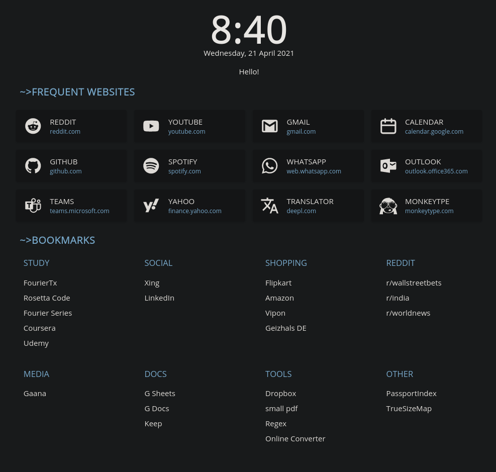

# Evening-Startpage

A comfy startpage, to get it running in firefox/chrome/etc follow the following steps:

- Create local webserver, Install apache2 and run it
  - For windows users kindly look for `local webserver in windows`

  ```shell
  sudo apt update; sudo apt install apache2
  sudo service apache2 restart 
  ```

- Copy the `assets` and `index.html` in `/var/www/html/` since ubunut only allows pages from this directory

- Change firefox's newtab to `http://localhost` using [this](https://addons.mozilla.org/de/firefox/addon/new-tab-override/) extension 
  - For chrome/etc user find the `new tab override` extension for your browser and set it to `http://localhost`


